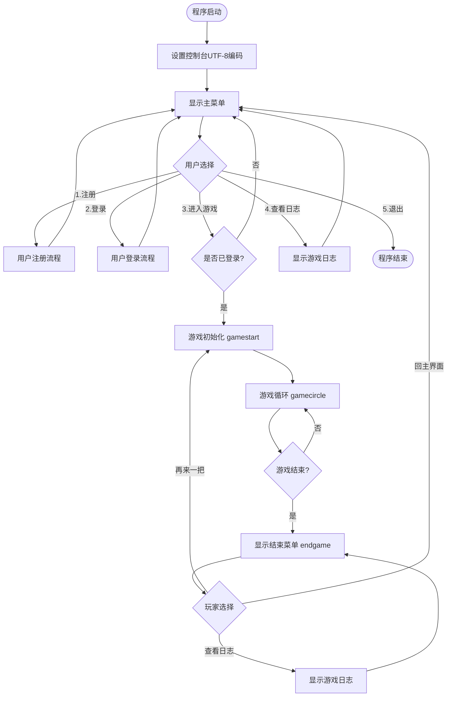
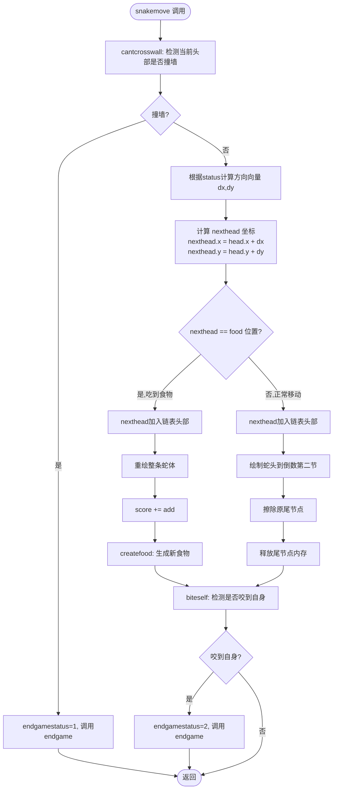

# 贪吃蛇游戏 (Snake Game)

> 实验四：结构化软件设计与实现  
> 开发语言：C（Windows 控制台）

## 目录

- [功能介绍](#功能介绍)
- [功能模块层次框图](#功能模块层次框图)
- [数据结构定义](#数据结构定义)
  - [用户表](#用户表)
  - [游戏日志表](#游戏日志表)
- [算法流程图](#算法流程图)
- [用户界面说明](#用户界面说明)
- [编译与运行](#编译与运行)
- [操作说明](#操作说明)

---

## 功能介绍

| 功能 | 说明 |
|------|------|
| 用户注册 | 首次使用时注册账号，密码隐式输入（显示`*`） |
| 用户登录 | 登录验证，最多允许 3 次失败 |
| 贪吃蛇游戏 | 键盘方向键控制，F1 加速、F2 减速，Space 暂停 |
| 得分系统 | 吃到食物自动加分，加速状态得分更高 |
| 游戏日志 | 每局自动记录用户、开始时间、时长、得分，支持随时查看 |
| 再来一把 | 游戏结束后可选择重开，无需重新登录 |

---

## 功能模块层次框图

```
贪吃蛇游戏系统
├── 用户管理模块
│   ├── 用户注册（registerUser）
│   │   ├── 检查用户名是否重复
│   │   ├── 隐式密码输入（readPassword）
│   │   └── 写入用户文件（users.dat）
│   └── 用户登录（loginUser）
│       ├── 读取用户文件验证
│       └── 失败次数限制（最多3次）
│
├── 游戏核心模块
│   ├── 地图初始化（creatMap）
│   ├── 蛇体初始化（initsnake）
│   ├── 食物生成（createfood）
│   │   └── 随机生成且不与蛇体重叠
│   ├── 蛇体移动（snakemove）
│   │   ├── 方向向量计算（dx/dy）
│   │   ├── 吃食物分支（蛇体增长）
│   │   └── 正常移动分支（头进尾出）
│   └── 碰撞检测
│       ├── 撞墙检测（cantcrosswall）
│       └── 咬自身检测（biteself）
│
├── 游戏控制模块
│   ├── 主菜单（showMainMenu）
│   ├── 游戏循环（gamecircle）
│   │   ├── 键盘输入响应
│   │   ├── 暂停（pause）
│   │   └── 得分实时更新
│   ├── 游戏开始初始化（gamestart）
│   └── 游戏结束处理（endgame）
│       ├── 保存日志
│       ├── 释放内存
│       └── 结束菜单（再来一把/查看日志/回主界面）
│
└── 日志模块
    ├── 保存日志（saveGameLog）
    └── 显示日志（showGameLog）
```

---

## 数据结构定义

### 用户表

存储文件：`users.dat`（文本格式，每行一条记录）

| 字段名 | 类型 | 长度 | 说明 |
|--------|------|------|------|
| `id` | int | 4 | 用户唯一标识，自增 |
| `username` | char | 32 | 用户名，注册时唯一 |
| `password` | char | 32 | 密码（明文存储） |

**存储格式示例：**
```
1 alice password123
2 bob mypassword
```

### 游戏日志表

存储文件：`gamelog.dat`（文本格式，`|` 分隔，每行一条记录）

| 字段名 | 类型 | 说明 |
|--------|------|------|
| `userID` | int | 对应用户表的 id |
| `username` | char[32] | 用户名 |
| `startTime` | char[20] | 游戏开始时间，格式 `YYYY-MM-DD HH:MM:SS` |
| `duration` | char[8] | 游戏时长，格式 `MM:SS` |
| `score` | int | 本局最终得分 |

**存储格式示例：**
```
1|alice|2025-04-24 10:30:00|02:15|180
2|bob|2025-04-24 11:00:00|00:47|50
```

---

## 算法流程图

### 主程序流程



### 蛇体移动算法流程



---

## 用户界面说明

| 颜色 | 用途 |
|------|------|
| 黄色 (14) | 标题栏、边框、得分高亮 |
| 绿色 (10) | 蛇体、已登录用户名 |
| 红色 (12) | 食物（★）、失败提示 |
| 青色 (11) | 得分面板、输入提示 |
| 灰色 (8) | 未登录状态提示 |

游戏中光标自动隐藏（`HideCursor`），返回主菜单后恢复（`ShowCursor`）。

---

## 编译与运行

**依赖环境：** Windows + MinGW (g++)

```bash
g++ -g Tanchishe_v2.cpp -o Tanchishe_v2.exe -Wall
Tanchishe_v2.exe
```

---

## 操作说明

| 按键 | 功能 |
|------|------|
| ↑ ↓ ← → | 控制蛇的移动方向 |
| `F1` | 加速（加分倍率提高） |
| `F2` | 减速（加分倍率降低） |
| `Space` | 暂停 / 继续 |
| `F5` | 游戏中查看历史日志 |
| `ESC` | 退出当前局 |
